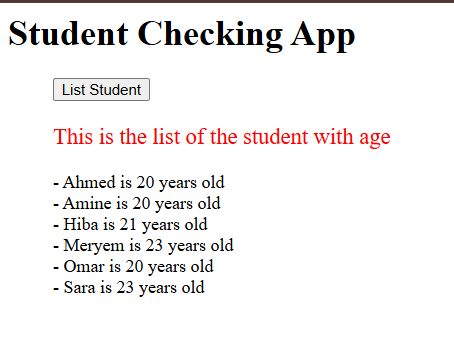

# Compte Rendu - Mini Projet Docker

---

## Création du fichier Dockerfile

1. **Image de base :** _Utilisez l'image `python:3.8-buster` pour garantir un environnement Python 3.8 cohérent sur Debian Buster._

```Dockerfile
    FROM python:3.8-buster
```

2. **Informations sur le mainteneur :** _Ajoutez des métadonnées (nom et email) concernant le mainteneur du Dockerfile._

```Dockerfile
    LABEL maintainer="name: votre_nom, email: votre_email@gmail.com"
```

3. **Script de l'application :** _Copiez le script `student_age.py` dans le répertoire racine du conteneur._

```Dockerfile
    COPY student_age.py /
```

4. **Dépendances système :** _Mettez à jour la liste des paquets et installez les en-têtes de développement Python ainsi que les bibliothèques SASL, LDAP et SSL nécessaires à certains paquets Python._

```Dockerfile
    RUN apt update -y && apt install python3-dev libsasl2-dev libldap2-dev libssl-dev -y 
```

5. **Dépendances Python :** _Copiez le fichier `requirements.txt` dans le conteneur et installez tous les paquets Python listés dans ce fichier à l'aide de pip._

```Dockerfile
    COPY requirements.txt /
    RUN pip3 install -r requirements.txt
```

6. **Répertoire de données et volume :** _Créez un répertoire `/data` destiné au stockage persistant des données. Déclarez `/data` comme un volume pour que les données survivent à la recréation du conteneur._

```Dockerfile
    RUN mkdir /data
    VOLUME [ "/data" ]
```

7. **Configuration réseau :** _Exposez le port 5000 pour permettre l'accès à l'application en cours d'exécution (probablement un service web)._

```Dockerfile
    EXPOSE 5000
```

8. **Commande de démarrage :** _Spécifiez que le conteneur doit exécuter le script `student_age.py` avec Python3 comme processus principal._

```Dockerfile
    CMD [ "python3", "student_age.py" ]
```

📎 **Fichier Dockerfile :** [Dockerfile](./simple_api/Dockerfile)

---

## Test de l'image

1. Construction de l'image

```powershell
$ docker build -t api:1.0 simple_api/
[+] Building 121.1s (11/11) FINISHED                                                                                                       docker:desktop-linux 
 => [internal] load build definition from Dockerfile                                                                                                       0.0s 
 => => transferring dockerfile: 1.59kB                                                                                                                     0.0s 
 => [internal] load metadata for docker.io/library/python:3.8-buster                                                                                       0.7s 
 => [internal] load .dockerignore                                                                                                                          0.0s 
 => => transferring context: 2B                                                                                                                            0.0s 
 => [internal] load build context                                                                                                                          0.1s 
 => => transferring context: 71B                                                                                                                           0.0s 
 => [1/6] FROM docker.io/library/python:3.8-buster@sha256:04c3f641c2254c229fd2f704c5199ff4bea57d26c1c29008ae3a4afddde98709                                50.9s 
 => => resolve docker.io/library/python:3.8-buster@sha256:04c3f641c2254c229fd2f704c5199ff4bea57d26c1c29008ae3a4afddde98709                                 0.1s 
 => => sha256:819d305a9b2210516eaf5929daf6caa015f1f0ffa8be96252cb05d0f283bfff5 19.29MB / 19.29MB                                                          10.7s 
 => => sha256:0ebfe287e9761b9b7dd1703470ff3473a62fe75238f3de01282165f8725968af 6.15MB / 6.15MB                                                             2.3s 
 => => sha256:a2e1e233599c00054fb839db78b4d42e6f12f36b64280aa62d482a3ad0ad7109 191.88MB / 191.88MB                                                        41.5s 
 => => sha256:b1e7e053c9f6f57c6d95002167a6d57aed6aacf04dd2f8e681cb4f74a7ca4381 51.87MB / 51.87MB                                                          35.5s 
 => => sha256:3b1c264c0ad4598c25048a6dbd3030086cc5c74000e11d04ac27944cb116aabb 17.58MB / 17.58MB                                                           9.8s 
 => => sha256:ac8bb7e1a32398e26c129ce64e2ddc3e7ec6c34d93424b247f16049f5a91cff4 50.45MB / 50.45MB                                                          29.2s 
 => => extracting sha256:ac8bb7e1a32398e26c129ce64e2ddc3e7ec6c34d93424b247f16049f5a91cff4                                                                  2.2s
 => => extracting sha256:3b1c264c0ad4598c25048a6dbd3030086cc5c74000e11d04ac27944cb116aabb                                                                  0.6s
 => => extracting sha256:b1e7e053c9f6f57c6d95002167a6d57aed6aacf04dd2f8e681cb4f74a7ca4381                                                                  2.0s
 => => extracting sha256:a2e1e233599c00054fb839db78b4d42e6f12f36b64280aa62d482a3ad0ad7109                                                                  5.1s
 => => extracting sha256:0ebfe287e9761b9b7dd1703470ff3473a62fe75238f3de01282165f8725968af                                                                  0.2s
 => => extracting sha256:819d305a9b2210516eaf5929daf6caa015f1f0ffa8be96252cb05d0f283bfff5                                                                  0.5s
 => => extracting sha256:a11e135762f00d55e3d68410f1aab593ca9850d9c2ca07f69fb5ac353fc99e0a                                                                  0.0s
```

2. Exécution du conteneur

- Première tentative (Erreur liée à un fichier manquant `student_age.json`)

```powershell
$ docker run --name mytest -p 5000:5000 api:1.0
Traceback (most recent call last):
  File "student_age.py", line 33, in <module>
    student_age_file = open(student_age_file_path, "r")
FileNotFoundError: [Errno 2] No such file or directory: '/data/student_age.json'
```

- Deuxième tentative après avoir copié le fichier dans le conteneur

```powershell
dell@DESKTOP-1FIQQ8A MINGW64 ~/Documents/Devops/student_list (majidi)
$ docker cp simple_api/student_age.json mytest:/data
Successfully copied 2.05kB to mytest:/data

dell@DESKTOP-1FIQQ8A MINGW64 ~/Documents/Devops/student_list (majidi)
$ docker start mytest
mytest
dell@DESKTOP-1FIQQ8A MINGW64 ~/Documents/Devops/student_list (majidi)
$ docker ps
CONTAINER ID   IMAGE               COMMAND                  CREATED          STATUS          PORTS                    NAMES
b70bea561599   api:1.0             "python3 student_age…"   16 minutes ago   Up 14 minutes   0.0.0.0:5000->5000/tcp   mytest
```

3. Verification du logs

```powershell
$ docker logs mytest
Traceback (most recent call last):
  File "student_age.py", line 33, in <module>
    student_age_file = open(student_age_file_path, "r")
FileNotFoundError: [Errno 2] No such file or directory: '/data/student_age.json'
 * Serving Flask app 'student_age' (lazy loading)
 * Environment: production
   WARNING: This is a development server. Do not use it in a production deployment.
   Use a production WSGI server instead.
 * Debug mode: on
 * Running on all addresses.
   WARNING: This is a development server. Do not use it in a production deployment.
 * Running on http://172.17.0.4:5000/ (Press CTRL+C to quit)
 * Restarting with stat
 * Debugger is active!
 * Debugger PIN: 127-926-424
```

4. Test avec la commande `curl`:

```powershell
$ curl -u root:root -X GET http://localhost:5000/supmit/api/v1.0/get_student_ages
{
  "student_ages": {
    "Ahmed": "20",
    "Amine": "20",
    "Hiba": "21",
    "Meryem": "23",
    "Omar": "20",
    "Sara": "23"
  }
}
```

## Creation du fichier Docker-compose

<details>
  <summary>Clicker pour afficher le code <strong><a href="./docker-compose.yml">docker-compose.yml</a></strong></summary>

```yml
version: "3.8"

services:
  website:
    image: php:apache
    environment:
      - USERNAME=root
      - PASSWORD=root
    volumes:
      - ./website:/var/www/html
    depends_on:
      - simple-api
    ports:
      - "80:80"
      
  simple-api:
    image: api:1.0
    volumes:
      - ./simple-api/student_age.json:/data/student_age.json
    ports:
      - "5000:5000"
    networks:
      - my-network

networks:
  my-network:
    driver: bridge

```
</details>

## Execution du docker compose
1. **Execution:**
```powershell
$ docker-compose up --build
time="2025-03-23T16:13:41Z" level=warning msg="C:\\Users\\dell\\Documents\\Devops\\student_list\\docker-compose.yml: the attribute `version` is obsolete, it will be ignored, please remove it to avoid potential confusion"
[+] Running 4/4
 ✔ Network student_list_my-network      Created                                                                            0.1s 
 ✔ Network student_list_default         Created                                                                            0.1s 
 ✔ Container student_list-simple-api-1  Created                                                                            0.2s 
 ✔ Container student_list-website-1     Created                                                                            0.3s 
Attaching to simple-api-1, website-1
simple-api-1  |  * Serving Flask app 'student_age' (lazy loading)
simple-api-1  |  * Environment: production
simple-api-1  |    WARNING: This is a development server. Do not use it in a production deployment.                             
simple-api-1  |    Use a production WSGI server instead.                                                                        
simple-api-1  |  * Debug mode: on                                                                                               
simple-api-1  |  * Running on all addresses.                                                                                    
simple-api-1  |    WARNING: This is a development server. Do not use it in a production deployment.
simple-api-1  |  * Running on http://172.19.0.2:5000/ (Press CTRL+C to quit)                                                    
simple-api-1  |  * Restarting with stat                                                                                         
website-1     | AH00558: apache2: Could not reliably determine the server's fully qualified domain name, using 172.20.0.2. Set the 'ServerName' directive globally to suppress this message
website-1     | AH00558: apache2: Could not reliably determine the server's fully qualified domain name, using 172.20.0.2. Set the 'ServerName' directive globally to suppress this message
website-1     | [Sun Mar 23 16:13:44.358519 2025] [mpm_prefork:notice] [pid 1:tid 1] AH00163: Apache/2.4.62 (Debian) PHP/8.4.5 configured -- resuming normal operations
website-1     | [Sun Mar 23 16:13:44.358606 2025] [core:notice] [pid 1:tid 1] AH00094: Command line: 'apache2 -D FOREGROUND'
simple-api-1  |  * Debugger is active!                                                                                          
simple-api-1  |  * Debugger PIN: 143-617-910
website-1     | 172.20.0.1 - - [23/Mar/2025:16:14:24 +0000] "GET / HTTP/1.1" 200 531 "-" "Mozilla/5.0 (Windows NT 10.0; Win64; x64) AppleWebKit/537.36 (KHTML, like Gecko) Chrome/134.0.0.0 Safari/537.36"
website-1     | 172.20.0.1 - - [23/Mar/2025:16:14:26 +0000] "GET / HTTP/1.1" 200 531 "-" "Mozilla/5.0 (Windows NT 10.0; Win64; x64) AppleWebKit/537.36 (KHTML, like Gecko) Chrome/134.0.0.0 Safari/537.36"
website-1     | 172.20.0.1 - - [23/Mar/2025:16:14:26 +0000] "GET /favicon.ico HTTP/1.1" 404 487 "http://localhost/" "Mozilla/5.0 (Windows NT 10.0; Win64; x64) AppleWebKit/537.36 (KHTML, like Gecko) Chrome/134.0.0.0 Safari/537.36"
website-1     | 172.20.0.1 - - [23/Mar/2025:16:14:27 +0000] "POST / HTTP/1.1" 200 830 "http://localhost/" "Mozilla/5.0 (Windows NT 10.0; Win64; x64) AppleWebKit/537.36 (KHTML, like Gecko) Chrome/134.0.0.0 Safari/537.36"
website-1     | 172.20.0.1 - - [23/Mar/2025:16:14:26 +0000] "GET / HTTP/1.1" 200 531 "-" "Mozilla/5.0 (Windows NT 10.0; Win64; x64) AppleWebKit/537.36 (KHTML, like Gecko) Chrome/134.0.0.0 Safari/537.36"
website-1     | 172.20.0.1 - - [23/Mar/2025:16:14:26 +0000] "GET /favicon.ico HTTP/1.1" 404 487 "http://localhost/" "Mozilla/5.0 (Windows NT 10.0; Win64; x64) AppleWebKit/537.36 (KHTML, like Gecko) Chrome/134.0.0.0 Safari/537.36"
website-1     | 172.20.0.1 - - [23/Mar/2025:16:14:27 +0000] "POST / HTTP/1.1" 200 830 "http://localhost/" "Mozilla/5.0 (Windows NT 10.0; Win64; x64) AppleWebKit/537.36 (KHTML, like Gecko) Chrome/134.0.0.0 Safari/537.36"
website-1     | 172.20.0.1 - - [23/Mar/2025:16:14:35 +0000] "GET / HTTP/1.1" 200 531 "-" "Mozilla/5.0 (Windows NT 10.0; Win64; x64) AppleWebKit/537.36 (KHTML, like Gecko) Chrome/134.0.0.0 Safari/537.36"
```

2. **Resultat:**
<div style="text-align: center;">



</div>
